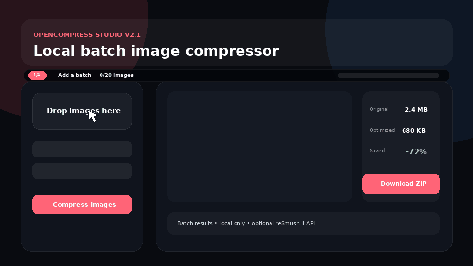

<div align="center">

# OpenCompress Studio

**Private-by-default batch image compression for shops, creators and the web.**

Compress, resize, convert and SEO-rename hundreds of images locally with Sharp, compare results visually and export the complete batch as a ZIP.

[](https://github.com/SLP-DEV1/OpenCompress/actions/workflows/ci.yml)
[](LICENSE)
[](https://nodejs.org/)
[](https://github.com/SLP-DEV1/OpenCompress/stargazers)

**No account. No SaaS subscription. No image upload in Local or Auto Best mode.**

</div>



> **20 images → Auto Best local → before/after comparison → one ZIP.** The default local modes keep image processing on your machine.

## Why OpenCompress?

Most image compressors are either single-file tools, cloud services or too generic for real shop workflows. OpenCompress Studio is built around repeatable batches:

- **Local-first:** JPG, PNG and WebP processing uses `sharp` on your own computer.
- **Shop-ready presets:** WooCommerce, Amazon, Etsy, Instagram, transparent PNG and small-web presets are included.
- **Batch workflow:** resize, convert, target a file size, rename for SEO and download everything in one ZIP.
- **Visual control:** before/after slider, candidate comparison and detailed per-file savings.
- **Safe defaults:** metadata removal and keep-original-if-larger are enabled by design.
- **Optional external comparison:** reSmush.it can be enabled explicitly and automatically falls back to local compression when possible.

## Quick start

### Windows

1. Download or clone the repository.
2. Double-click `start.bat`.
3. Open `http://127.0.0.1:5174` if the browser does not open automatically.

The helper checks Node.js, installs dependencies on first run, builds the app and starts the local server.

### macOS / Linux / developers

```bash
git clone https://github.com/SLP-DEV1/OpenCompress.git
cd OpenCompress
npm ci
npm run dev
```

Open `http://127.0.0.1:5174`.

## Feature highlights

- Batch upload for up to 250 images
- JPG, PNG, WebP, GIF, TIF and BMP input
- JPG, PNG and WebP output
- Local compression with `sharp`
- Auto Best local mode that tests multiple output candidates and keeps the smallest
- Optional reSmush.it API compression
- Auto Compare local vs reSmush.it
- Fair Compare mode with matching format, quality and dimensions
- Target file-size search for JPG/WebP
- Resize with maximum width and height while preventing enlargement
- Metadata removal by default
- Optional EXIF preservation for reSmush.it mode
- Transparency warnings and configurable JPG background color
- SEO batch rename with start number and padding
- Keep-original-if-larger protection
- Before/after preview with zoom
- Per-candidate comparison
- Detailed result table with dimensions, formats, quality, method, status and savings
- ZIP export with `opencompress-report.json`
- Automatic cleanup of temporary jobs

## Privacy modes

| Mode | Works offline | Sends images externally | Best for |
| --- | --- | --- | --- |
| **Local only** | Yes | No | Default private workflow |
| **Auto Best local** | Yes | No | Smallest local result without cloud uploads |
| **reSmush.it API** | No | Yes | Explicit external compression |
| **Auto Compare** | No | Yes | Comparing local output with reSmush.it |

Local-only processing stores temporary job files in `.opencompress/` and removes old jobs automatically after the configured TTL.

> If you bind `OPENCOMPRESS_HOST` to a non-loopback address, the local API becomes reachable from your network. Keep the default `127.0.0.1` unless you intentionally want remote access.

## Recommended shop presets

### WooCommerce product images

```text
Mode: Local only or Auto Best local
Format: WebP
Quality: 82
Max size: 1600 × 1600 px
Metadata: remove
```

### Amazon main images

```text
Mode: Local only
Format: JPG
Quality: 90
Max size: 2000 × 2000 px
Background: white
Metadata: remove
```

### Etsy listing images

```text
Mode: Local only
Format: JPG
Quality: 86
Max size: 2000 × 2000 px
Metadata: remove
```

### Transparent artwork

```text
Mode: Local only or Auto Best local
Format: PNG or WebP
Avoid JPG unless you intentionally want to flatten transparency
```

## Target file size

Enable **Target file size** and enter a maximum KB value. For JPG and WebP, OpenCompress searches for the highest quality that gets under the requested target when possible.

If the target cannot be reached, the result is still returned with a warning instead of silently failing.

## reSmush.it support

reSmush.it is optional and is never used by Local only or Auto Best local mode.

Supported external inputs:

```text
JPG, PNG, GIF, TIF, BMP
```

WebP remains available through local processing. Files unsupported by reSmush.it fall back to local compression when the selected workflow permits it.

## Requirements

- Node.js **20.19+** or **22.12+**
- npm 10+
- A modern Chromium, Firefox or Safari browser
- Internet access only for dependency installation and optional reSmush.it modes

## Production build

```bash
npm ci
npm run build
npm start
```

Open `http://127.0.0.1:5174`.

## Useful scripts

```bash
npm run dev              # Local development server with Vite middleware
npm start                # Production server using dist/
npm run build            # Type-check and build production assets
npm run typecheck        # TypeScript checks
npm run typecheck:strict # TypeScript checks including unused-code detection
npm run clean            # Remove dist, node_modules and .opencompress
```

## Configuration

Copy `.env.example` or set environment variables before starting the app:

```bash
OPENCOMPRESS_PORT=5174
OPENCOMPRESS_HOST=127.0.0.1
OPENCOMPRESS_MAX_UPLOAD_MB=100
OPENCOMPRESS_JOB_TTL_MS=3600000
OPENCOMPRESS_EXTERNAL_TIMEOUT_MS=30000
OPENCOMPRESS_PUBLIC_REFERER=https://github.com/SLP-DEV1/OpenCompress
OPENCOMPRESS_USER_AGENT=OpenCompress-Studio/2.1.0
```

## Project structure

```text
OpenCompress/
├─ src/                  React UI
├─ server/               Local Express + Sharp processing API
├─ docs/                 Repository media and documentation
├─ scripts/              Repository maintenance helpers
├─ .github/workflows/    CI automation
├─ start.bat             Windows one-click build + start
├─ stop.bat              Windows local-server stop helper
└─ README.md
```

## Roadmap

Good next contributions include:

- Real per-file streaming progress
- Drag-and-drop file sorting
- AVIF export
- SSIM / visual quality scoring
- Saved custom presets
- Multi-language UI
- Optional local AI upscaling backends

Have an idea that would make OpenCompress more useful? Open a feature request instead of keeping it in a fork.

## Contributing

Contributions are welcome. Start with [`CONTRIBUTING.md`](CONTRIBUTING.md), run the strict typecheck and build before opening a pull request, and keep privacy-sensitive behavior explicit.

For security issues, please read [`SECURITY.md`](SECURITY.md) before opening a public issue.

## License

MIT. See [`LICENSE`](LICENSE).

---

If OpenCompress saves you time, starring the repository helps more people discover it.
